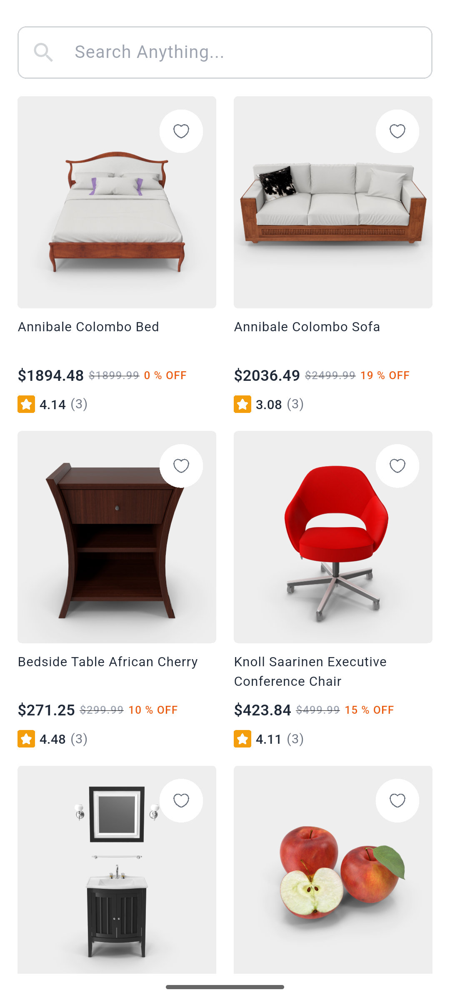

# 🛒 E-Commerce Product Listing App

<div align="center">
    <div>
        
    </div><br>
    <div>
        <a href="https://drive.usercontent.google.com/download?id=1nvMdFAE0aHMgCo8KJ8tH4hoDnQk-60pR&export=download&confirm=t&uuid=730a06b6-6001-4faf-a7cf-748dafa2e731" target="_blank">
    
  </a>
    </div>
</div>

A simple Flutter app to display a list of products fetched from an API with pagination.  

## 📱 Screenshots

<div align="center">
  <table>
    <tr>
      <td align="center">
        
        <p>Splash Screen</p>
      </td>
      <td align="center">
        
        <p>Product Screen</p>
      </td>
    </tr>
  </table>
</div>

---

## ✨ Features

- Product listing with infinite scroll (pagination)
- State management using **BLoC**
- Minimized UI rebuilds for better performance
- Follows **Clean Architecture**
- Includes unit and widget tests

---

## 🔗 API Reference

- [DummyJSON](https://dummyjson.com/)

---

## 🛠️ Tech Stack

- **Flutter** 3.7.2
- **State Management**: BLoC
- **Testing** : Unit Test & Widget Test

---

## 📚 Architecture

- Clean separation of layers:
  - **Presentation**
  - **Domain**
  - **Data**
- Helps in scalability and maintainability.

---

## Environment Variables

This project uses a `.env` file to manage sensitive configuration values. Create a `.env` file in the root of your project and add the following variables:

```plaintext
 BASE_URL = "https://dummyjson.com"
 ```

---

## 🚀 How to Run

You can either clone and run the project locally or directly download the APK.

### Option 1: Clone and Run Locally

```bash
git clone https://github.com/shahiduldeowan/e_commerce_product_listing_app.git
cd e_commerce_product_listing_app

# Install dependencies
flutter pub get

# Generate necessary files
flutter pub run build_runner build --delete-conflicting-outputs

# Run the app
flutter run
```

### Option 2: Download the APK

Want to test it quickly?

👉 [Download the APK here](https://drive.usercontent.google.com/download?id=1nvMdFAE0aHMgCo8KJ8tH4hoDnQk-60pR&export=download&confirm=t&uuid=730a06b6-6001-4faf-a7cf-748dafa2e731)

- After downloading, install the APK on your Android device.
- Make sure to allow "Install from Unknown Sources" if prompted.

---

## Authors

- [@shahiduldeowan](https://www.linkedin.com/in/shahiduldeowan/)
